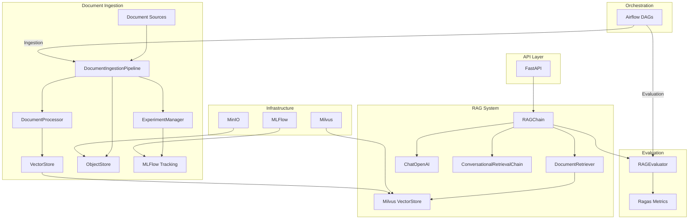

# RAG - Ops: RAG with Operations

We help you to deploy RAG with changing in datasources.

Note: Everything are under-construction and experimental!

## Start application

1. Clone the project

```bash
git clone https://github.com/hllj/rag-ops
```

2. Go to the directory 

```bash
cd rag-ops
```

3. Install libraries

```bash
pip install -r requirements.txt
```

4. Start services with Docker

Start MLFlow, Milvus, Minio, API endpoint

```bash
docker compose up -d
```

5. Manually uploading new documents

Upload pdf files in documents/ folder

Data will automatically be processed and stored in vector store.

```
documents/
│   *.pdf : new update files
└───processed/: processed files
└───error/: error files
```

Examples: Copy some documents from folder /examples/examples_document to test

```bash
cp examples/examples_document/* documents/
```

6. Check processed documents in MLFlow experiment


7. Use API to query RAG

Accessing API /api/v1/query.

```bash
curl -X 'POST' \
  'http://localhost:8000/api/v1/query' \
  -H 'accept: application/json' \
  -H 'Content-Type: application/json' \
  -d '{
  "question": "What is the role of Jensen'\''s inequality ?",
  "chat_history": []
}'
```

## Diagram



Key Components:

1. Document Ingestion:
- DocumentIngestionPipeline: Main orchestrator
- DocumentProcessor: Handles document parsing and chunking
- ObjectStore: MinIO storage for raw documents
- VectorStore: Milvus interface for embeddings

2. RAG System:
- RAGChain: Core RAG implementation
- DocumentRetriever: Handles document retrieval
- LangChain integration for RAG orchestration

3. Evaluation:
- RAGEvaluator: Ragas-based evaluation
- Metrics tracking in MLFlow

4. API Layer:
- FastAPI endpoints for RAG queries
- Health monitoring

5. Infrastructure:
- Milvus for vector storage
- MinIO for document storage
- MLFlow for experiment tracking

6. Orchestration:
- Airflow DAGs for automated:
    - Document ingestion
    - Model evaluation
    - Pipeline scheduling

Data Flow:

1. Documents → Ingestion Pipeline
2. Processing → Vector Storage
3. Query → RAG Chain
4. Retrieval → Answer Generation
5. Evaluation → MLFlow Tracking

This architecture follows MLOps principles with:

- Continuous monitoring
- Version control
- Automated evaluation
- Experiment tracking
- Infrastructure as code

## Stack

- MLFlow: Experiments management.
- Minio: Storage.
- Milvus: Vector Store.
- LangChain: Data and RAG Orchestration.
- Ragas: RAG Evaluation.
- LlamaParse: Document Parser.
- FastAPI.

Much more to come, stay tune.

## To-do List

- MLFlow + Ragas: track all experiment metadata (e.g, hyperparams, embedding, RAG pipeline configuration, ...), show evaluation score.
- Version Control: Data, RAG chain.
- Automation and CI/CD pipelines.
- Monitor and Logging.
- Feedback Loops for Continuous Improvement.
- Explaninablity and Interpretability
- Dashboard