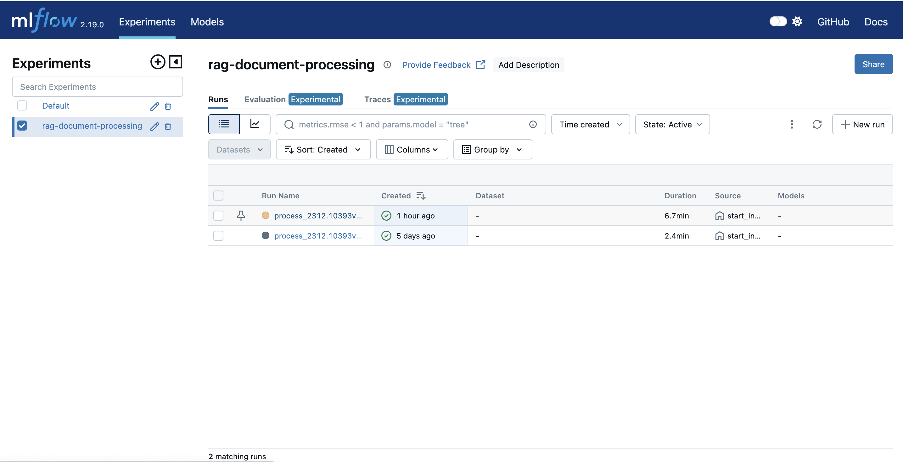
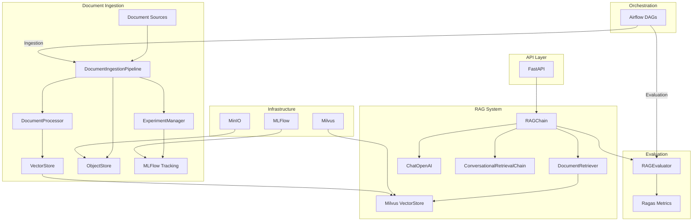

# RAG - Ops: RAG with Operations

We help you to deploy RAG with changing in datasources.

Note: Everything are under-construction and experimental!

## Getting Started

### Prerequisites

- Python 3.11+
- Docker and Docker Compose
- OpenAI API key
- LlamaParse API key (for document parsing)

### Environment Setup

1. Create a `.env` file based on the `.env.example`:

```bash
cp .env.example .env
```

2. Add your API keys to the `.env` file:

```txt
OPENAI_API_KEY=your-openai-api-key
LLAMA_PARSE_API=your-llama-parse-api-key
```

### Start application

1. Clone the project

```bash
git clone https://github.com/hllj/rag-ops
```

2. Go to the directory 

```bash
cd rag-ops
```

3. Install libraries

```bash
pip install -r requirements.txt
```

4. Start services with Docker

Start MLFlow, Milvus, Minio, API endpoint

```bash
docker compose up -d
```

5. Manually uploading new documents

Upload pdf files in documents/ folder

Data will automatically be processed and stored in vector store.

```
documents/
│   *.pdf : new update files
└───processed/: processed files
└───error/: error files
```

Examples: Copy some documents from folder /examples/examples_document to test

```bash
cp examples/examples_document/* documents/
```

6. Check processed documents in MLFlow experiment



7. Use API to query RAG

Accessing API /api/v1/query.

```bash
curl -X 'POST' \
  'http://localhost:8000/api/v1/query' \
  -H 'accept: application/json' \
  -H 'Content-Type: application/json' \
  -d '{
  "question": "What is the role of Jensen'\''s inequality ?",
  "chat_history": []
}'
```

## Directory Structure

```txt
rag-ops/
├── api/                # FastAPI application
├── config/             # Configuration files
├── dags/               # Airflow DAGs
├── datasets/           # Validation datasets
├── documents/          # Document storage
├── src/                # Source code
│   ├── data/           # Data handling components
│   ├── evaluation/     # Evaluation components
│   ├── ml/             # ML experiment tracking
│   ├── monitoring/     # Monitoring components
│   ├── pipeline/       # Ingestion pipeline
│   ├── rag/            # RAG components
│   └── utils/          # Utility functions
└── tests/              # Unit tests
```

## Diagram



Key Components:

1. Document Ingestion:
- DocumentIngestionPipeline: Main orchestrator
- DocumentProcessor: Handles document parsing and chunking
- ObjectStore: MinIO storage for raw documents
- VectorStore: Milvus interface for embeddings

2. RAG System:
- RAGChain: Core RAG implementation
- DocumentRetriever: Handles document retrieval
- LangChain integration for RAG orchestration

3. Evaluation:
- RAGEvaluator: Ragas-based evaluation
- Metrics tracking in MLFlow

4. API Layer:
- FastAPI endpoints for RAG queries
- Health monitoring

5. Infrastructure:
- Milvus for vector storage
- MinIO for document storage
- MLFlow for experiment tracking

6. Orchestration:
- Airflow DAGs for automated:
    - Document ingestion
    - Model evaluation
    - Pipeline scheduling

Data Flow:

1. Documents → Ingestion Pipeline
2. Processing → Vector Storage
3. Query → RAG Chain
4. Retrieval → Answer Generation
5. Evaluation → MLFlow Tracking

This architecture follows MLOps principles with:

- Continuous monitoring
- Version control
- Automated evaluation
- Experiment tracking
- Infrastructure as code

## Tech Stack

- MLFlow: Experiments management.
- Minio: Storage.
- Milvus: Vector Store.
- LangChain: Data and RAG Orchestration.
- Ragas: RAG Evaluation.
- LlamaParse: Document Parser.
- FastAPI: API development framework.
- Ragas: RAG evaluation framework.
- Sentence Transformers: Embedding models.
- Prometheus: Metrics collection.
- Airflow: Workflow orchestration.
- Docker: Containerization.

## Developer Guide

### Adding New Document Sources
To add a new document source:

1. Create a new source handler class in `src/pipeline/sources/`
2. Extend the `SourceHandler` base class
3. Implement the required methods
4. Register the source handler in `DocumentIngestionPipeline`

### Customizing the RAG Chain
To customize the RAG chain:

1. Modify the prompt templates in `src/rag/prompt_templates.py`
2. Update retriever configurations in `config/config.yaml`
3. Extend the `RAGChain` class for additional functionality

## To-do List

### Completed ✅
- [x] Data Processing and RAG pipeline
  - [x] Document ingestion pipeline
  - [x] Vector store integration
  - [x] RAG chain implementation
  - [x] API endpoints
- [x] MLFlow Integration
  - [x] Experiment tracking
  - [x] Model registry
  - [x] Configuration versioning
  - [x] Evaluation metrics logging
- [x] Evaluation Framework
  - [x] Ragas metrics integration
  - [x] Automated evaluation pipeline
  - [x] Performance benchmarking
- [x] Infrastructure
  - [x] Docker containerization
  - [x] Milvus vector store setup
  - [x] MinIO object storage
  - [x] FastAPI service
- [x] Orchestration
  - [x] Airflow DAGs implementation
  - [x] Document processing automation
  - [x] Evaluation scheduling

### In Progress 🚧
- [ ] Automation and CI/CD pipelines
  - [ ] GitHub Actions workflows
  - [ ] Automated testing
  - [ ] Deployment automation
- [ ] Version Control
  - [ ] Data versioning
  - [ ] Model versioning
  - [ ] Configuration management
  - [ ] Embedding version control

### Planned 📋
- [ ] Monitoring and Logging
  - [ ] Prometheus metrics
  - [ ] Grafana dashboards
  - [ ] Performance monitoring
  - [ ] Cost tracking
- [ ] Feedback Loops
  - [ ] User feedback collection
  - [ ] Performance analysis
  - [ ] Model improvements
- [ ] Explainability
  - [ ] Answer source tracking
  - [ ] Confidence scores
  - [ ] Retrieval visualization
- [ ] Dashboard
  - [ ] Performance metrics
  - [ ] System monitoring
  - [ ] User analytics
  - [ ] Document management